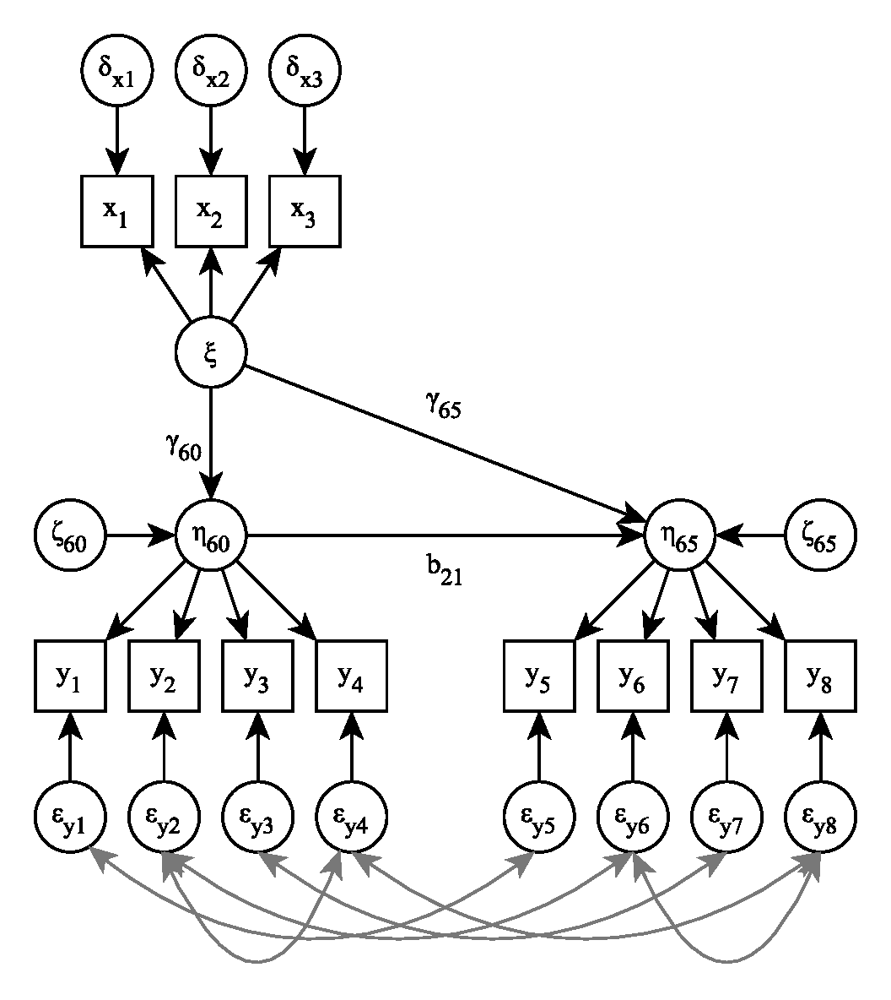

```{r setup, include=FALSE}
library(ggplot2)
```

## Overview

- Introduction
  + Bayesian analysis
  + Why use Bayesian SEM?
  + Why not to use Bayesian SEM?
- Break
- Prior specification
  + Hands-on session prior specification
- A Bayesian SEM example
- Exercises
- Additional information

# Introduction 

## Bayesian analysis 

<div style="float: left; width: 50%;">
**Frequentist estimation** \ 
<br>
<br>
<ul>
  <li>Probability as long-run relative frequency</li>  
  <li>Parameters are fixed</li> 
  <li>Estimation through optimization</li> 
</ul>
</div>

<div style="float: right; width: 50%;">
**Bayesian estimation** \ 
<br>
<br>
<ul>
  <li>Probability as belief</li>   
  <li>Parameters are random and can be assigned a *prior*</li>   
  <li>Estimation through sampling</li> 
</ul>
</div>

## Bayesian analysis {.build}

Bayesian estimation relies on the data and the prior: 
$$
p(\pmb{\theta}|Y) \propto p(Y|\pmb{\theta})p(\pmb{\theta})
$$

```{r eval = TRUE, echo = FALSE}
# data
n <- 1
md <- 10
sdd <- 1
x <- rnorm(n, mean = md, sd = sdd)

# prior
m0 <- 0
sd0 <- 1

# posterior
post.mean <- ((n/(sdd^2) + 1/(sd0^2))^-1)*(n/(sdd^2) * mean(x) + 1/(sd0^2)*m0)
post.sd <- sqrt((n/(sdd^2) + 1/(sd0^2))^-1)

# plot
ggplot(data = data.frame(x = c(-5, 15)), aes(x)) + 
  stat_function(fun = dnorm, n = 200, args = list(mean = m0, sd = sd0), aes(linetype = "Prior")) +
  stat_function(fun = dnorm, n = 200, args = list(mean = md, sd = sdd), aes(linetype = "Likelihood")) +
  stat_function(fun = dnorm, n = 200, args = list(mean = post.mean, sd = post.sd), aes(linetype = "Posterior")) +
  scale_linetype_manual("", values = c(3, 1, 2)) +
  labs(x = "", y = "") +
  theme_bw(base_size = 14) + 
  theme(axis.text.y = element_blank(), axis.ticks.y = element_blank())
```

## Why use Bayesian SEM?

Bayesian SEM: specify a prior for each parameter and build the posterior using MCMC sampling.

*Advantages*

- Add information via the prior
  - smaller samples needed
  - regularization of estimates
- More complex models can be estimated
- Automatic uncertainty estimates

## Why not to use Bayesian SEM?

- Add information via the prior
- MCMC sampling requires assessment of convergence
- Relatively novel
  - active area of research
  - availability in software
  - researchers unfamiliar

# Questions?

# Prior specification

## Types of priors

<div style="float: left; width: 45%;">
<ul>
  <li>Priors vary in the amount of information they carry</li>  
  <li>From "non-informative" to highly informative</li> 
  <li>Informativeness of the prior depends on the problem</li> 
</ul>
</div>

<div style="float: right; width: 55%;">
```{r fig.show = "hold", out.width = "70%", eval = TRUE, echo = FALSE}
n <- 10e5

# non-informative
sd1 <- sqrt(10^10)
plot(density(rnorm(n, mean = 0, sd = sd1)),
     type = "l",
     yaxt = "n",
     xlab = "",
     ylab = "",
     main = "Normal(0, 10^10)",
     xlim = c(-5, 5))

# informative
sd2 <- 1
plot(density(rnorm(n, mean = 0, sd = sd2)),
     type = "l",
     yaxt = "n",
     xlab = "",
     ylab = "",
     main = "Normal(0, 1)",
     xlim = c(-5, 5))

# highly informative
sd3 <- 0.1
plot(density(rnorm(n, mean = 0, sd = sd3)),
     type = "l",
     yaxt = "n",
     xlab = "",
     ylab = "",
     main = "Normal(0, 0.01)",
     xlim = c(-5, 5))

```
</div>

## A warning on default priors

- Traditionally, heavy reliance on "default" priors
- Adding no information through the prior can give the same results as ML
- But: default priors can inadvertently influence the results, e.g. IG(.001, .001) prior (<font size = "3">e.g., van Erp et al. (2018); van Erp & Browne (2021)</font>)
- Some software programs are not explicit about their priors, but it can be influential

## The power of the prior

- Weakly informative priors to regularize estimates
- Informative priors to include prior research or expert opinions
- Shrinkage priors to identify non-identified models

## How to be careful with the prior

- Carefully consider the priors (or look up the automatic defaults)
- Visualize your priors
- Conduct a prior sensitivity analysis

## Hands-on: Prior specification with Shiny BSEM

Go to: [https://github.com/sara-vanerp/shinyBSEM](https://github.com/sara-vanerp/shinyBSEM) \

Think about reasonable priors for all parameters (or use the defaults) and inspect the results. \

Change the priors to see how this influences the results. 

# A Bayesian SEM example with blavaan

## Political democracy example


## Packages
```{r message = FALSE}
library(blavaan)
library(bayesplot)
```


## Step 1: Define the model
See the [lavaan website](https://lavaan.ugent.be/tutorial/index.html) for more information about lavaan syntax.

```{r}
mod0 <- '
  # measurement model
    ind60 =~ x1 + x2 + x3
    dem60 =~ y1 + y2 + y3 + y4
    dem65 =~ y5 + y6 + y7 + y8
  # regressions
    dem60 ~ ind60
    dem65 ~ ind60 + dem60
  # residual correlations
    y1 ~~ y5
    y2 ~~ y4 + y6
    y3 ~~ y7
    y4 ~~ y8
    y6 ~~ y8
'
```

## Step 2: Priors - blavaan defaults
```{r}
# check the blavaan defaults
dpriors()
```

## Step 2: Priors - plotting the defaults (1)
```{r priors0, cache = TRUE, results = 'hide', message = FALSE, warning = FALSE}
priors0 <- bsem(mod0, 
                data = PoliticalDemocracy,
                prisamp = TRUE,
                sample = 1000)
```

```{r plot_priors0, echo = TRUE, eval = FALSE}
samples0 <- as.matrix(blavInspect(priors0, what = "mcmc"))
pars <- dimnames(samples0)[[2]]
mcmc_areas(na.omit(samples0),
           pars = pars[9:11])
```

---

```{r plot_priors0, echo = FALSE, eval = TRUE}
```

## Step 2: Priors - plotting the defaults (2)
```{r}
plot(density(rnorm(10000, mean = 0, sd = 10)),
     xlab = "", ylab = "", main = "", yaxt = "n")
```

## Step 2: Change the priors (1) {.smaller}
```{r priors1, cache = TRUE, results = 'hide', message = FALSE, warning = FALSE, echo = TRUE, eval = FALSE}
mod1 <- '
  # measurement model
    ind60 =~ x1 + x2 + x3
    dem60 =~ y1 + y2 + y3 + y4
    dem65 =~ y5 + y6 + y7 + y8
  # regressions
    dem60 ~ prior("normal(0.5, 1)")*ind60
    dem65 ~ ind60 + dem60
  # residual correlations
    y1 ~~ y5
    y2 ~~ y4 + y6
    y3 ~~ y7
    y4 ~~ y8
    y6 ~~ y8
'
priors1 <- bsem(mod1, 
                data = PoliticalDemocracy,
                prisamp = TRUE, 
                sample = 1000)
samples1 <- as.matrix(blavInspect(priors1, what = "mcmc"))
mcmc_areas(na.omit(samples1),
           pars = pars[9:11])
```

---

```{r priors1, cache = TRUE, results = 'hide', message = FALSE, warning = FALSE, echo = FALSE, eval = TRUE}
```

## Step 2: Change the priors (2)
```{r priors2psi, cache = TRUE, results = 'hide', message = FALSE, warning = FALSE}
mcmc_areas(na.omit(samples1),
           pars = pars[29])
```

---

```{r priors2, cache = TRUE, results = 'hide', message = FALSE, warning = FALSE, , echo = TRUE, eval = FALSE}
priors2 <- bsem(mod0,
                data = PoliticalDemocracy,
                dp = dpriors(psi = "gamma(1,.5)[var]"),
                prisamp = TRUE,
                sample = 1000)
samples2 <- as.matrix(blavInspect(priors2, what = "mcmc"))
mcmc_areas(na.omit(samples2),
           pars = pars[29])
```

---

```{r priors2, cache = TRUE, results = 'hide', message = FALSE, warning = FALSE, , echo = FALSE, eval = TRUE}
```

## Step 3: Run the model 
```{r fit, cache = TRUE, results = 'hide', message = FALSE, warning = FALSE}
fit <- bsem(mod0, 
            data = PoliticalDemocracy,
            n.chains = 3,
            burnin = 500,
            sample = 1000)
```

## Step 4: Check convergence {.smaller}
```{r}
summary(fit)
```


---
```{r}
plot(fit, pars = c(1:8), plot.type = "trace")
```

## Step 5: Check the results (1)
```{r}
plot(fit, pars = c(9:11), plot.type = "areas", prob = 0.8)
```

## Step 5: Check the results (2)
```{r}
plot(fit, pars = c(1:8), plot.type = "intervals", prob = 0.5, prob.outer = 0.9)
```

## Step 5: Check the results (3)
```{r fitind, cache = TRUE, warning = FALSE}
fitind <- blavFitIndices(fit)
summary(fitind)
```

## Step 6: Prior sensitivity analysis

- Rerun the analysis with different priors
- Change all priors for one type of parameter simultaneously
- When default priors are used, check different default priors
- When (weakly) informative priors are used, change the informativeness
- Report a range of results
- Focus on the outcome of interest (e.g. a specific estimate, whether a 95%CI contains 0, etc.)
- Goal is to get an idea of the robustness of the results

# Exercises

# Additional information

## References {.smaller}
*General Bayesian (introductory) texts* \
Etz, A., Gronau, Q. F., Dablander, F., Edelsbrunner, P. A., & Baribault, B. (2017). How to become a Bayesian in eight easy steps: An annotated reading list. Psychonomic Bulletin & Review, 25(1), 219–234. \
Depaoli, S., & Van de Schoot, R. (2017). Improving transparency and replication in Bayesian statistics: The WAMBS-Checklist. Psychological methods, 22(2), 240.\
Gelman, A., Carlin, J. B., Stern, H. S., Dunson, D. B., Vehtari, A., & Rubin, D. B. (2013). Bayesian data analysis (3rd ed.). Chapman and Hall/CRC. \

*Bayesian SEM* \
Depaoli, S. (2021). Bayesian Structural Equation Modeling. Guilford Press. \
Lee, S-Y. (2007). Structural Equation Modeling: A Bayesian Approach. Wiley. \

*Prior sensitivity* \
Van Erp, S., Mulder, J., & Oberski, D. L. (2018). Prior sensitivity analysis in default Bayesian structural equation modeling. Psychological Methods, 23(2), 363-388. \
Van Erp, S. & Browne, W. J. (2021). Bayesian Multilevel Structural Equation Modeling: An Investigation into Robust Prior Distributions for the Doubly Latent Categorical Model. Structural Equation Modeling: A Multidisciplinary Journal, 28:6, 875-893.

## References {.smaller}
*Blavaan* \
Merkle, E. C., & Rosseel, Y. (2018). blavaan: Bayesian Structural Equation Models via Parameter Expansion. Journal of Statistical Software, 85, 1-30. \
Merkle, E. C., Fitzsimmons, E., Uanhoro, J., & Goodrich, B. (2021). Efficient Bayesian Structural Equation Modeling in Stan. Journal of Statistical Software, 100, 1-22. \
[Online tutorial](https://www.rensvandeschoot.com/tutorials/blavaan-how-to-get-started/) \

*Fit indices* \
Garnier-Villarreal, M., & Jorgensen, T. D. (2020). Adapting fit indices for Bayesian structural equation modeling: Comparison to maximum likelihood. Psychological Methods, 25(1), 46.
